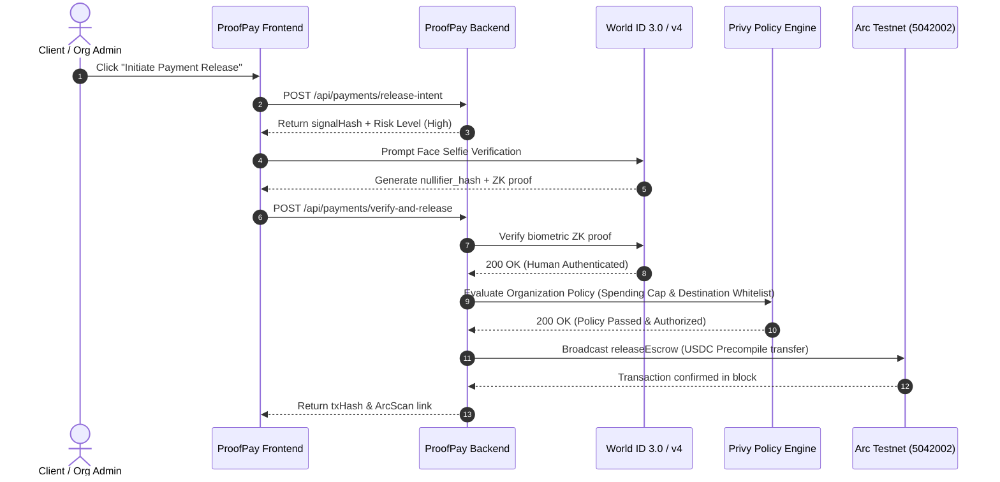

# ProofPay: Privy Wallet Policy & Arc Settlement Architecture

## 1. Executive Summary

ProofPay uses **Circle's Arc Testnet (Chain ID `5042002`)** as its foundational settlement layer and **Privy** as the enterprise wallet management and policy enforcement engine. 

The address `0x37Da1f17986e4DC6d4E8D86713791698F07c8099` is configured as the **Managed Organization Vault & Protocol Relayer**. It has been funded with **100 USDC** (gas and precompile ERC-20) and is directly governed by Privy organization policies.

---

## 2. Onchain Settlement & Asset Details

| Parameter | Value | Explorer / Verification Link |
| :--- | :--- | :--- |
| **Network** | Arc Testnet | RPC: `https://rpc.testnet.arc.network` |
| **Chain ID** | `5042002` | `0x4cef52` |
| **Organization Vault Address** | `0x37Da1f17986e4DC6d4E8D86713791698F07c8099` | [View Vault on ArcScan](https://testnet.arcscan.app/address/0x37Da1f17986e4DC6d4E8D86713791698F07c8099) |
| **Escrow Contract Address** | `0x60cfC204D8D7A2a87483c08Be5127193545b4894` | [View Escrow Contract on ArcScan](https://testnet.arcscan.app/address/0x60cfC204D8D7A2a87483c08Be5127193545b4894) |
| **USDC Precompile Contract** | `0x3600000000000000000000000000000000000000` | [Arc Native USDC Precompile](https://testnet.arcscan.app/address/0x3600000000000000000000000000000000000000) |
| **Deployment Transaction** | `0x801c5ef10de5feeea2518f18b7405000c89334ab7df2ee997b47c92a3d0d3e6f` | [View Deployment Tx on ArcScan](https://testnet.arcscan.app/tx/0x801c5ef10de5feeea2518f18b7405000c89334ab7df2ee997b47c92a3d0d3e6f) |
| **USDC Max Approval Tx** | `0x7c5486b0eb0f5fb448d1ebbb64424a0737acbd6a856b4bbfae5646bf774e2540` | [View Approval Tx on ArcScan](https://testnet.arcscan.app/tx/0x7c5486b0eb0f5fb448d1ebbb64424a0737acbd6a856b4bbfae5646bf774e2540) |
| **Live Gas Balance** | `~98.36 ETH/USDC` | Native gas on Arc L1 |
| **Live USDC Token Balance** | `~98.36 USDC` | Native 6-decimal USDC |

---

## 3. How Privy Manages the Address & Policies

### 3.1 Architecture Overview
Privy sits between the client application and the Arc blockchain to enforce organizational treasury governance:

### 3.2 Privy Policy Rules Applied to `0x37Da1f17986e4DC6d4E8D86713791698F07c8099`
1. **Per-Transaction Spending Cap:**
   - Enforces that no single milestone payout exceeds the organization's limit (e.g. `$2,500 USDC`).
   - Payouts above this limit are rejected by `PrivyService.evaluateOrganizationPolicy`.
2. **Recipient Destination Validation:**
   - Validates that the freelancer's payout address is a valid checksummed EVM address.
   - Rejects blacklisted or malformed addresses.
3. **Multi-Factor Triggering:**
   - Any transaction designated as high-risk or exceeding standard velocity requires cryptographic proof from World ID before Privy authorization is issued.
4. **Relayer Co-Signing:**
   - The backend relayer signs and executes the Arc transaction only when both World ID verification and Privy policy evaluations succeed.

---

## 4. API Endpoints

### 4.1 Vault Status
- **`GET /api/payments/vault-status`**
- Returns live RPC balance, deployed contract address, and Privy organization status.

### 4.2 Payment Verification & Release
- **`POST /api/payments/verify-and-release`**
- Verifies World proof + Privy policy and executes onchain release on Arc.

---

## 5. Contract Source & Verification Details
- **Source:** `contracts/src/ProofPayEscrow.sol`
- **Compiler:** Solidity `0.8.24`
- **Constructor Parameters:**
  - `_usdcToken`: `0x3600000000000000000000000000000000000000`
  - `_relayer`: `0x37Da1f17986e4DC6d4E8D86713791698F07c8099`
